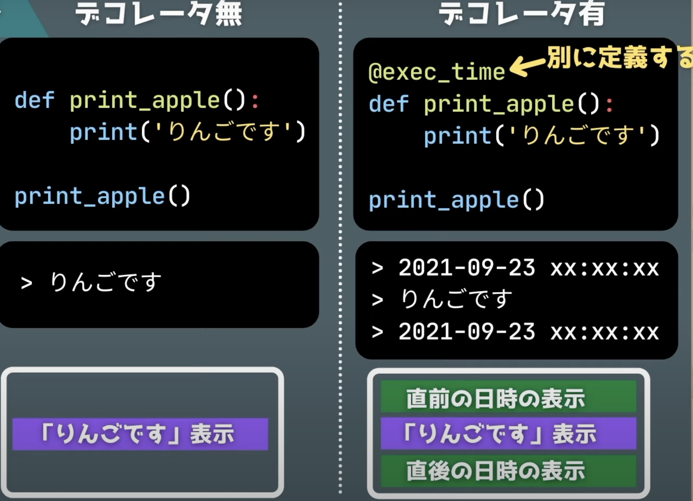
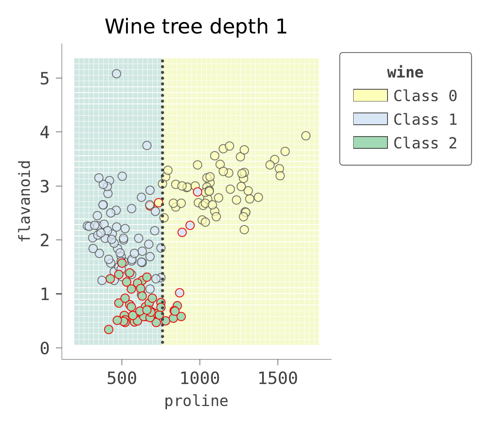
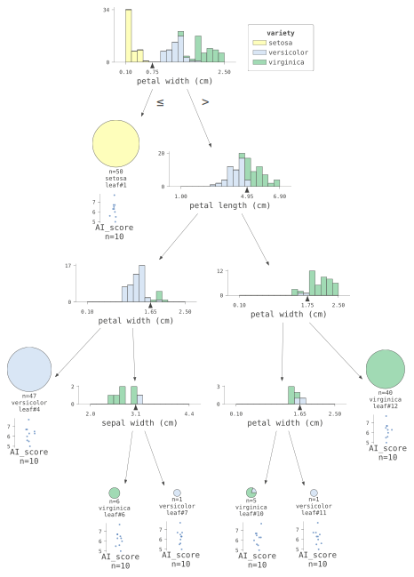

# dash_or_streamlit
dashとstreamlitの挙動比較実験

## 動作方法
GitPod上で
> python intro_dash.py  

または  

> streamlit run intro_streamlit.py

## 参考YouTube
- dashはhttps://www.youtube.com/watch?v=hSPmj7mK6ng
- streamlitはhttps://www.youtube.com/watch?v=JwSS70SZdyM&t=161s

## 違いを一言で言うと
https://qiita.com/hikarut/items/bbf099da841bff5e769c  
によると・・・　　

DashはPlotlyのみをサポート  

Streamlitは
- Matplotlib
- Altair
- Graphviz
- Bokeh  
等の可視化ライブラリもサポートしています。  

  
https://www.datarevenue.com/en-blog/data-dashboarding-streamlit-vs-dash-vs-shiny-vs-voila

## References: dash code 
Great works from :  
https://github.com/Coding-with-Adam/Dash-by-Plotly/tree/master/Other

I will remove all python code for dash, as soon as the conversion to streamlit finished.

## Data Resources 
Gender_StatsData.csv  https://www.kaggle.com/datasets/salehahmedrony/gender-statistics?resource=download&select=Gender_StatsData.csv

# 2023追記
## dtreeviz
dash, streamlitそれぞれ適用した. 
いずれもsvgファイルを生成し、 `img src="data:image/svg+xml` タグにより貼り付ける形態。  
pngファイルでも同等となる. 

dtreevizのサンプルノートにあった、アニメーションpng生成のコードも参考にし、取り込んだ. 

アニメーションpng生成に当たっては、dtreevizの機能とアニメーション作成のコードが混在しているとわかりづらいので、ptyhonのデコレータ機能を導入してみた. 

## dtreeviz github
https://github.com/parrt/dtreeviz

## デコレータ
https://www.youtube.com/watch?v=A4md-u022MY
. 
. 
これを使って以下をstreamlit上に表示した

### アニメーション作成.ipynb, streamlit
- by dtreeviz : classifier-boundary-animations.ipynb
- implemented : dtreeviz_streamlit.py

## dtreeviz の改造
dtreevizを改造して.svgの出力の中に任意のプロットを追加できるようにした

### svg viewer by streamlit
- implemented : st_svg_show.py

### .ipynb, streamlit
- sample_dtreeviz.ipynb

dtreevizを改造して.svgの出力の中でエンコードラベルの元の値を表示できるようにした

### .ipynb, streamlit
- sample_dtreeviz-titanic.ipynb